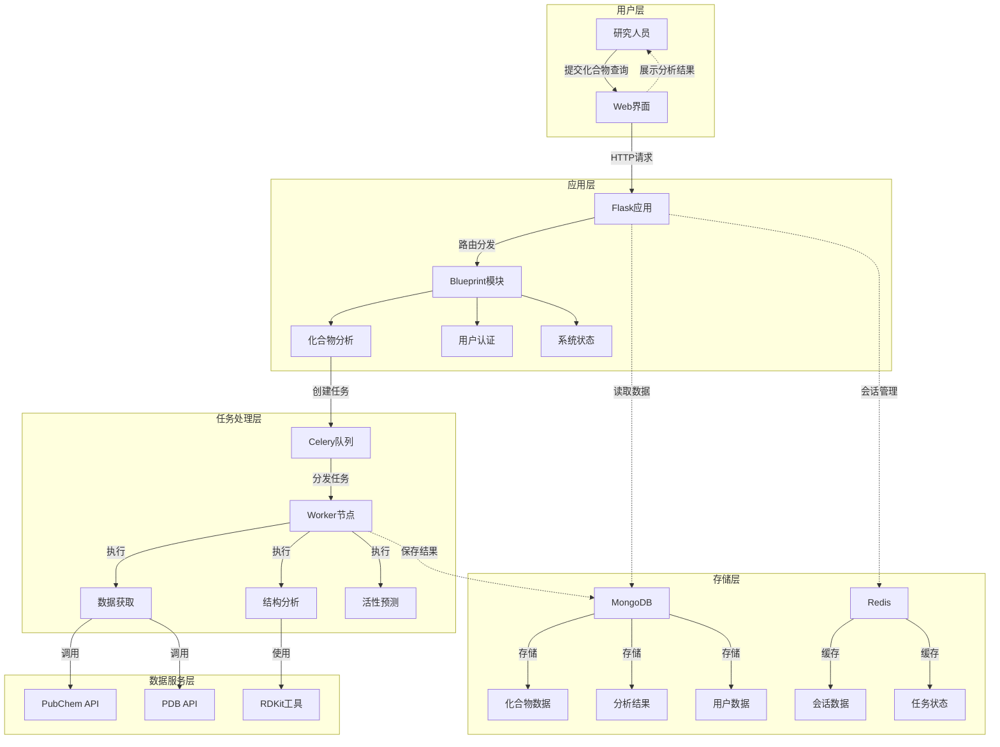

* 用户通过Web界面提交化合物查询请求
* Flask创建Celery异步任务并通过Redis分发
* Worker节点并行处理：获取外部数据→进行计算分析→保存到MongoDB
* 数据库同时支持实时查询和批量分析
* 可视化层与数据存储层直接对接展示结果

```mermaid
graph TD
    subgraph 用户层
        A[研究人员] -->|提交化合物查询| B[Web界面]
        B -.->|展示分析结果| A
    end

    subgraph 应用层
        B -->|HTTP请求| C[Flask应用]
        C -->|路由分发| D[Blueprint模块]
        D --> D1[化合物分析]
        D --> D2[用户认证]
        D --> D3[系统状态]
    end

    subgraph 任务处理层
        D1 -->|创建任务| E[Celery队列]
        E -->|分发任务| F[Worker节点]
        F -->|执行| F1[数据获取]
        F -->|执行| F2[结构分析]
        F -->|执行| F3[活性预测]
    end

    subgraph 数据服务层
        F1 -->|调用| G1[PubChem API]
        F1 -->|调用| G2[PDB API]
        F2 -->|使用| G3[RDKit工具]
    end

    subgraph 存储层
        H[MongoDB] -->|存储| H1[化合物数据]
        H -->|存储| H2[分析结果]
        H -->|存储| H3[用户数据]
        
        I[Redis] -->|缓存| I1[会话数据]
        I -->|缓存| I2[任务状态]
    end

    F -.->|保存结果| H
    C -.->|读取数据| H
    C -.->|会话管理| I
```
